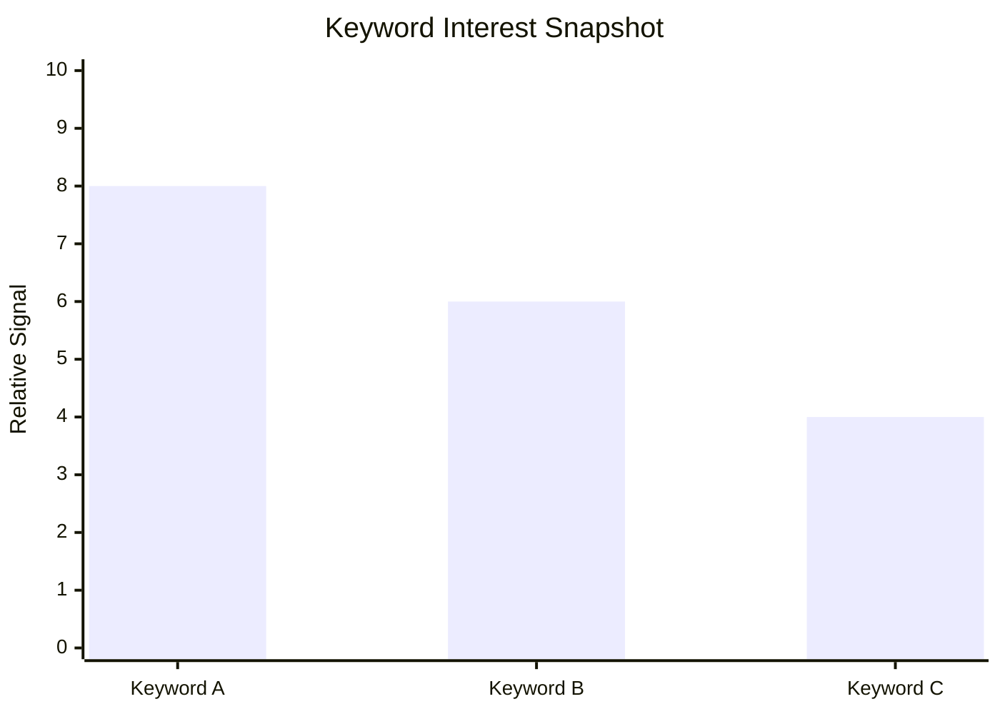

# Startup Idea Discovery

Generate one research-backed startup idea similar in spirit to IdeaBrowser-style opportunities: specific, current, evidence-backed, and actionable for a small founding team.

## Research Standard

Do fresh research before presenting an idea. Use current web sources, community discussions, keyword signals, competitor pages, trend data, and market reports when available.

Every specific claim should have a source URL. If exact numbers are unavailable, say so and use directional evidence instead of fabricating estimates.

Prioritize ideas with:

- A painful, repeated problem
- Clear buyer or user
- Evidence of existing demand
- A narrow wedge for an MVP
- Reachable distribution channels
- A credible path from first sale to repeatable revenue
- A reason the opportunity is newly possible, newly painful, or newly urgent

Avoid ideas that require massive capital, regulatory approval as the core blocker, mature network effects before value exists, or a broad consumer app launch with no wedge.

## Discovery Process

### 1. Pick A Search Territory

Start with 2 to 4 territories. Good territories include:

- Fast-changing software categories
- Expensive manual workflows
- New compliance or platform changes
- Communities with repeated complaints
- B2B niches using spreadsheets, email, or manual operations
- Creator, ecommerce, healthcare admin, local services, finance ops, education ops, real estate ops, and professional services

For each territory, search for recent evidence:

- Market growth and budget movement
- New pain caused by regulation, AI, platform changes, labor shortages, or cost pressure
- Communities discussing workarounds
- Competitors with traction but visible gaps
- Search queries with commercial intent

### 2. Find Problem Signals

Look for evidence that people already spend time, money, or social energy on the problem:

- Reddit, forums, Discord, Slack communities, Facebook Groups, LinkedIn posts
- YouTube tutorials, comparison videos, and comments
- App reviews and marketplace reviews
- Job posts asking for manual work that software could reduce
- Templates, spreadsheets, consultants, agencies, or courses solving part of the problem
- "Alternative to", "best", "pricing", "how to", "automate", "template", and "software for" searches

Capture exact language when it reveals urgency, but quote sparingly.

### 3. Map Existing Alternatives

Identify 5 to 10 alternatives:

- Direct SaaS competitors
- Agencies or consultants
- Templates or spreadsheets
- Internal manual workflows
- Horizontal tools used awkwardly for the job

Look for gaps:

- Too expensive
- Too complex
- Built for enterprises, not small teams
- Missing a specific workflow
- Poor integrations
- Weak onboarding
- Not AI-native
- No vertical specialization

### 4. Score The Idea

Score each dimension from 0 to 10. Use evidence, not vibes.

**Opportunity** measures market potential, competitive landscape, and overall business opportunity.

- 0 to 3: Tiny market, weak buying intent, crowded with strong incumbents
- 4 to 6: Real demand but unclear wedge, modest market, or heavy competition
- 7 to 8: Strong demand, reachable wedge, meaningful budget, visible gaps
- 9 to 10: Large and growing market, urgent demand, weak incumbents, excellent wedge

**Feasibility** gauges how realistically a small founding team can build and launch.

- 0 to 3: Requires deep regulation, hardware, large data moats, or enterprise sales before the product proves value
- 4 to 6: Buildable but has integration, data, trust, or workflow complexity
- 7 to 8: MVP is clear, small team can launch quickly, distribution is plausible
- 9 to 10: Very focused MVP, simple buyer, clear acquisition channel, low operational burden

**Problem** evaluates how acutely the target market feels the pain.

- 0 to 3: Nice-to-have, low urgency, little evidence of active searching
- 4 to 6: Recognized annoyance, some workarounds, inconsistent urgency
- 7 to 8: Frequent pain, costly workflow, active searching, repeated complaints
- 9 to 10: Severe pain with budget, compliance pressure, revenue loss, or clear operational burden

**Why Now** evaluates timing and urgency.

- 0 to 3: No clear market catalyst
- 4 to 6: Some trend support but not urgent
- 7 to 8: Current technology, regulation, behavior, or market shift creates a window
- 9 to 10: Strong new catalyst makes the idea newly possible or newly necessary

## Required Idea Card

Present one idea using this structure.

### Title

Use a clear, concrete title. Prefer "Tool for audience to outcome" over clever names.

### Description

Write 3 to 5 sentences explaining the product, target user, core problem, and MVP wedge.

### Scores

Use a simple table:

| Dimension | Score | Rationale |
| --- | ---: | --- |
| Opportunity | 0-10 | Evidence-based rationale |
| Feasibility | 0-10 | Evidence-based rationale |
| Problem | 0-10 | Evidence-based rationale |
| Why Now | 0-10 | Evidence-based rationale |

### Keyword Graph And Insights

Include a lightweight keyword insight table and a small text graph if data is available.

Required fields:

| Keyword | Intent | Signal | Notes |
| --- | --- | --- | --- |

For the graph, use one of these formats:

```text
Keyword demand snapshot
workflow automation       ██████████ High
template for X            ██████ Medium
software for Y            ████ Emerging
```

or:



Use relative signals when exact search volume is not available. Label them as relative.

### Business Fit

Explain:

- Best-fit founder profile
- Required domain knowledge
- Sales motion fit
- Whether this is better as SaaS, service-led software, marketplace, data product, or agency-to-SaaS

### Revenue Potential

Describe:

- Likely buyer
- Pricing model
- Path from initial sale to repeatable revenue
- Expansion potential
- Major monetization risks

### Execution Difficulty

Describe:

- MVP complexity
- Data, integration, or compliance challenges
- Trust and support burden
- What a 2 to 3 person founding team can ship first

### Go To Market

Describe:

- First niche
- First channel
- Lead magnet or wedge offer
- Sales motion
- First 10 customer strategy

### Community Signals

Include:

- 3 to 5 communities, threads, channels, reviews, or public discussions
- What each signal reveals
- URLs for each source

### Top Keywords

Include 5 to 10 keywords. Separate by type when possible:

- Fastest growing
- Highest volume
- Most relevant commercial intent

### Offer

Write the first concrete offer. It should be specific enough to sell before the full product exists.

Use this shape:

`We help [specific customer] get [desired outcome] without [painful tradeoff] by using [specific mechanism or wedge].`

### Why Now

Explain the timing catalyst. Tie it to sources, not generic AI optimism.

Examples of acceptable catalysts:

- New regulation
- New platform behavior
- AI capability shift
- Cost pressure
- Labor shortage
- Consumer behavior shift
- Newly accessible data or APIs

### Proof And Signals

Summarize the strongest evidence:

- Market data
- Search behavior
- Community pain
- Competitor traction
- Budget or job-posting evidence
- Founder-accessible distribution

### Market Gap

Name the gap in the existing market and why incumbents are not already solving it well.

### Execution Plan

Give a result-based plan with phases specific to the idea. Do not use calendar estimates, day counts, or generic timeboxes. LLMs should not estimate duration; they should define the sequence of proof needed to move from uncertainty to traction.

Each phase should be named for the milestone it proves. Use phases like these only when they fit the idea:

1. Problem proof
2. Buyer proof
3. Concierge delivery proof
4. Repeatable workflow proof
5. Productized MVP proof
6. Distribution proof
7. Retention or expansion proof

For each phase, include:

- Goal
- Concrete actions
- Evidence required to pass the phase
- Kill or pivot criteria
- What to build only after the phase is proven

## Another Idea Loop

If the user asks for another idea:

1. Keep the same output format.
2. Change at least one of the territory, audience, pain point, or go-to-market motion.
3. Do fresh research.
4. Avoid repeating the same opportunity with different wording.

## Quality Bar

A good idea should make the user think, "I understand who this is for, why they would pay, how I could test it through a concrete proof step, and why this opportunity exists now."

A weak idea is generic, broad, source-light, dependent on vague virality, or impossible for a small founding team to validate quickly.
